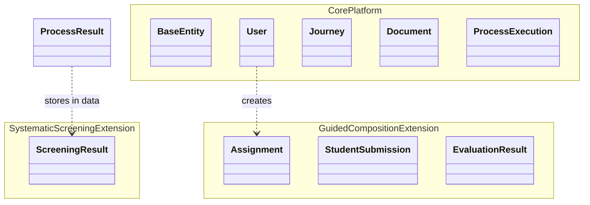
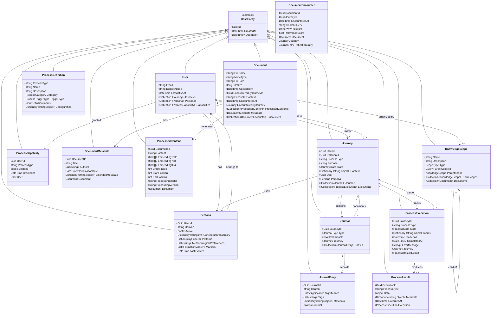
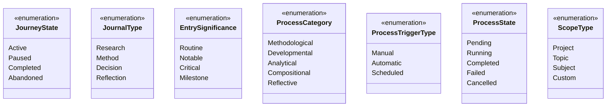
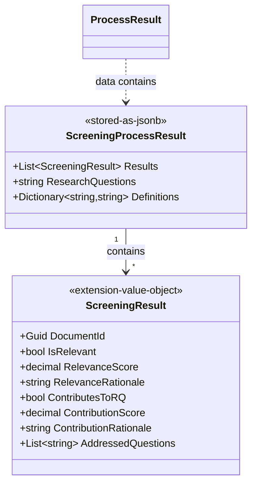
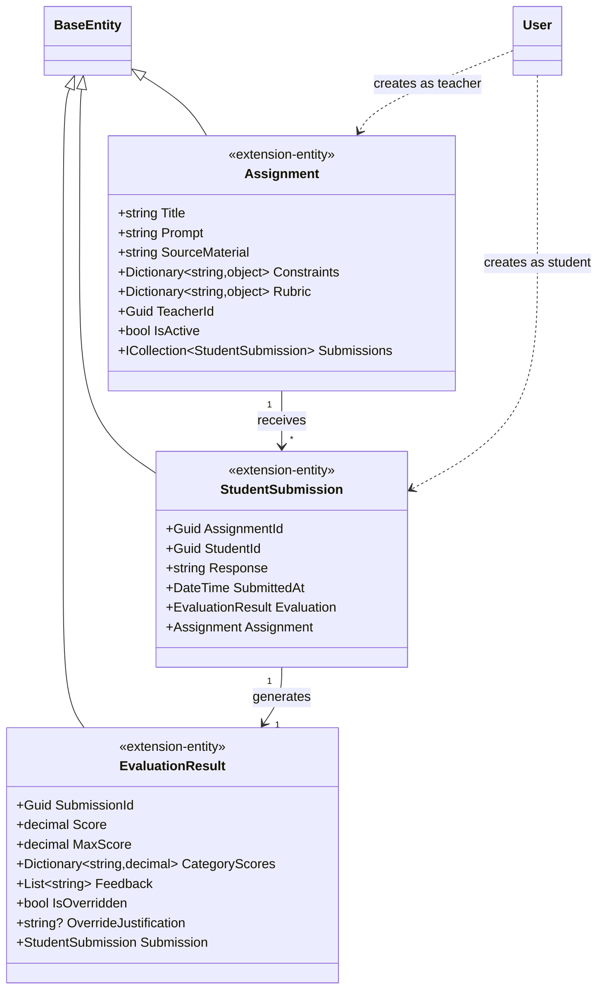

# Class Model

This document defines the core domain classes and their relationships within Veritheia. The model clearly separates the core platform (which all deployments require) from process-specific extensions (which demonstrate extensibility patterns).

## Overview Diagram



## Core Platform Classes

These classes form the foundation that all processes depend on. They cannot be modified by extensions.

### Core Platform Class Diagram



### Core Enumerations



### Core Value Objects

These are transient or stored as JSONB within core entities:


## Extension Classes (Process-Specific)

These classes demonstrate how processes extend the platform. New processes follow these patterns.

### Systematic Screening Extension

This extension stores its results entirely within ProcessResult.Data:



### Guided Composition Extension

This extension uses dedicated tables for complex educational workflows:



## Platform Boundaries

### What Core Platform Provides

- **User and Journey Management**: Identity, personas, journeys, journals
- **Knowledge Storage**: Documents, metadata, embeddings, scopes
- **Process Infrastructure**: Definitions, executions, results
- **Platform Services**: Document processing, embedding generation, context assembly

### What Extensions Provide

- **Process-Specific Logic**: How to analyze, compose, or reflect
- **Domain Entities**: Assignment, submission, evaluation, etc.
- **Result Structures**: ScreeningResult, CompositionResult, etc.
- **UI Components**: Process-specific interfaces
- **Additional Tables**: When complex queries needed

### What Extensions MUST NOT Do

- Modify core platform tables
- Bypass journey/journal system
- Access other processes' data directly
- Create users outside platform
- Store data outside ProcessResult without proper relationships

## Storage Patterns for Extensions

### Pattern 1: JSONB in ProcessResult.Data

Use when:
- Results are read-mostly
- Don't need complex relational queries
- Want to avoid schema migrations
- Data is naturally document-oriented

Example: SystematicScreeningProcess stores List<ScreeningResult> as JSONB

### Pattern 2: Dedicated Extension Tables

Use when:
- Need referential integrity (foreign keys)
- Require complex queries or joins
- Have ongoing state management
- Need efficient updates to specific fields

Example: GuidedCompositionProcess uses assignments, student_submissions, evaluation_results tables

## Value Objects vs Entities

### Stored as JSONB (Value Objects)
- InquiryPattern (in Persona.patterns)
- FormationMarker (in Persona.markers)
- InputDefinition (in ProcessDefinition.inputs)
- ScreeningResult (in ProcessResult.data)
- ProcessContext (transient, not persisted)
- JourneyContext (assembled at runtime)
- PersonaContext (assembled at runtime)

### Persisted as Tables (Entities)
- All classes inheriting from BaseEntity
- Core platform classes always have tables
- Extension entities may have tables (like Assignment)

## Repository Patterns

### Core Repositories (Always Present)
- `IUserRepository`
- `IPersonaRepository` 
- `IJourneyRepository`
- `IDocumentRepository`
- `IKnowledgeScopeRepository`
- `IProcessExecutionRepository`

### Extension Repositories (Process-Specific)
- `IAssignmentRepository` (GuidedComposition)
- Future extensions add their own

### Repository Access Patterns

```csharp
// Accessing user with all personas
var user = await userRepository.GetAsync(userId);
var personas = await personaRepository.GetByUserIdAsync(userId);

// Get specific persona by domain
var studentPersona = await personaRepository.GetByUserAndDomainAsync(userId, "Student");

// Create journey with specific persona
var journey = await journeyService.CreateJourneyAsync(new CreateJourneyRequest
{
    UserId = userId,
    PersonaId = studentPersona.Id,
    ProcessType = "SystematicScreening",
    Purpose = "Literature review for thesis"
});

// Extensions access core data through services
var documents = await knowledgeRepository.GetDocumentsInScopeAsync(scopeId);
```

## Design Principles

### Core Platform Principles
- **Aggregate Boundaries**: Each aggregate maintains internal consistency
- **Entity Identity**: All entities use GUID primary keys
- **Journey Context**: Every process execution tied to user journey
- **Intellectual Sovereignty**: Data structures ensure personal authorship

### Extension Principles
- **Process Isolation**: Extensions cannot access other processes' data
- **Platform Integration**: Must use platform services for core operations
- **Result Flexibility**: Choose appropriate storage pattern
- **User Attribution**: All data traceable to authoring user

### SOLID Compliance
- **Single Responsibility**: Each class has one reason to change
- **Open/Closed**: Platform open for extension, closed for modification
- **Liskov Substitution**: All processes are substitutable IAnalyticalProcess
- **Interface Segregation**: Interfaces focused on specific capabilities
- **Dependency Inversion**: Extensions depend on abstractions, not concretions

## Future Considerations

### Event Sourcing Preparation
- Journal entries form natural event stream
- Process executions track state transitions
- Persona evolution captures changes over time

### Multi-Tenancy Ready
- All entities include user/journey ownership
- Scopes provide logical isolation
- Extensions respect boundaries

The class model ensures that technical structure serves the core principle: users author their own understanding through structured engagement with knowledge, while enabling rich extensions for different analytical patterns.