# Class Model

This document defines the core domain classes and their relationships within Veritheia. The model implements **journey-specific projection spaces** where documents are transformed according to user-defined intellectual frameworks. The architecture clearly separates the core platform (required for all deployments) from process-specific extensions (which demonstrate extensibility patterns).

## Important Architecture Note

**Entities serve as domain models**: In this MVP architecture, the entity classes in `veritheia.Data/Entities` ARE the domain models. There is no separate domain model layer. Business logic resides in services (Phase 6), not in the models themselves. This is an intentional simplification appropriate for the MVP.

**Journey Projections Replace Universal Processing**: Documents don't have universal chunks or embeddings. Instead, each journey projects documents into its own intellectual space through `JourneyDocumentSegment`. The older `ProcessedContent` concept has been replaced by this journey-specific architecture.

## Overview Diagram


## Core Platform Classes

These classes form the foundation that all processes depend on. They cannot be modified by extensions.

### Core Platform Class Diagram

```mermaid
classDiagram
    %% Base Classes
    class BaseEntity {
        <<abstract>>
        +Guid Id
        +DateTime CreatedAt
        +DateTime? UpdatedAt
    }

    %% User and Journey Domain (Core)
    class User {
        +string Email
        +string DisplayName
        +DateTime LastActiveAt
        +ICollection~Journey~ Journeys
        +ICollection~Persona~ Personas
        +ICollection~ProcessCapability~ Capabilities
    }

    class Persona {
        +Guid UserId
        +string Domain
        +bool IsActive
        +Dictionary~string,int~ ConceptualVocabulary
        +List~InquiryPattern~ Patterns
        +List~string~ MethodologicalPreferences
        +List~FormationMarker~ Markers
        +DateTime LastEvolved
    }

    class Journey {
        +Guid UserId
        +Guid PersonaId
        +string ProcessType
        +string Purpose
        +JourneyState State
        +Dictionary~string,object~ Context
        +User User
        +Persona Persona
        +ICollection~Journal~ Journals
        +ICollection~ProcessExecution~ Executions
    }

    class Journal {
        +Guid JourneyId
        +JournalType Type
        +bool IsShareable
        +Journey Journey
        +ICollection~JournalEntry~ Entries
    }

    class JournalEntry {
        +Guid JournalId
        +string Content
        +EntrySignificance Significance
        +List~string~ Tags
        +Dictionary~string,object~ Metadata
        +Journal Journal
    }

    class ProcessCapability {
        +Guid UserId
        +string ProcessType
        +bool IsEnabled
        +DateTime GrantedAt
        +User User
    }

    %% Knowledge Domain (Core)
    class Document {
        +string FileName
        +string MimeType
        +string FilePath
        +long FileSize
        +DateTime UploadedAt
        +Guid? ScopeId
        +KnowledgeScope Scope
        +ICollection~JourneyDocumentSegment~ JourneySegments
        +DocumentMetadata Metadata
    }

    class DocumentMetadata {
        +Guid DocumentId
        +string Title
        +List~string~ Authors
        +DateTime? PublicationDate
        +Dictionary~string,object~ ExtendedMetadata
        +Document Document
    }

    %% Journey Projection Classes (Core)
    class JourneyFramework {
        +Guid JourneyId
        +string JourneyType
        +Dictionary~string,object~ FrameworkElements
        +Dictionary~string,object~ ProjectionRules
        +Journey Journey
    }

    class JourneyDocumentSegment {
        +Guid JourneyId
        +Guid DocumentId
        +string SegmentContent
        +string? SegmentType
        +string? SegmentPurpose
        +Dictionary~string,object~? StructuralPath
        +int SequenceIndex
        +NpgsqlRange~int~? ByteRange
        +string? CreatedByRule
        +string? CreatedForQuestion
        +Journey Journey
        +Document Document
        +ICollection~SearchIndex~ SearchIndexes
        +ICollection~JourneySegmentAssessment~ Assessments
    }

    class SearchIndex {
        +Guid SegmentId
        +string VectorModel
        +int VectorDimension
        +DateTime IndexedAt
        +JourneyDocumentSegment Segment
    }

    class SearchVector1536 {
        +Guid IndexId
        +Vector Embedding
        +SearchIndex Index
    }

    class SearchVector768 {
        +Guid IndexId
        +Vector Embedding
        +SearchIndex Index
    }

    class SearchVector384 {
        +Guid IndexId
        +Vector Embedding
        +SearchIndex Index
    }

    class JourneySegmentAssessment {
        +Guid SegmentId
        +string AssessmentType
        +int? ResearchQuestionId
        +float? RelevanceScore
        +float? ContributionScore
        +Dictionary~string,object~? RubricScores
        +string? AssessmentReasoning
        +Dictionary~string,object~? ReasoningChain
        +string? AssessedByModel
        +DateTime AssessedAt
        +JourneyDocumentSegment Segment
    }

    class JourneyFormation {
        +Guid JourneyId
        +string InsightType
        +string InsightContent
        +Dictionary~string,object~? FormedFromSegments
        +Dictionary~string,object~? FormedThroughQuestions
        +string? FormationReasoning
        +string? FormationMarker
        +DateTime FormedAt
        +Journey Journey
    }

    class KnowledgeScope {
        +string Name
        +string Description
        +ScopeType Type
        +Guid? ParentScopeId
        +KnowledgeScope ParentScope
        +ICollection~KnowledgeScope~ ChildScopes
        +ICollection~Document~ Documents
    }

    %% Process Infrastructure (Core)
    class ProcessDefinition {
        +string ProcessType
        +string Name
        +string Description
        +ProcessCategory Category
        +ProcessTriggerType TriggerType
        +InputDefinition Inputs
        +Dictionary~string,object~ Configuration
    }

    class ProcessExecution {
        +Guid JourneyId
        +string ProcessType
        +ProcessState State
        +Dictionary~string,object~ Inputs
        +DateTime StartedAt
        +DateTime? CompletedAt
        +string? ErrorMessage
        +Journey Journey
        +ProcessResult Result
    }

    class ProcessResult {
        +Guid ExecutionId
        +string ProcessType
        +object Data
        +Dictionary~string,object~ Metadata
        +DateTime ExecutedAt
        +ProcessExecution Execution
    }

    %% Core Relationships
    BaseEntity <|-- User
    BaseEntity <|-- Persona
    BaseEntity <|-- Journey
    BaseEntity <|-- JourneyFramework
    BaseEntity <|-- Journal
    BaseEntity <|-- JournalEntry
    BaseEntity <|-- Document
    BaseEntity <|-- DocumentMetadata
    BaseEntity <|-- JourneyDocumentSegment
    BaseEntity <|-- SearchIndex
    BaseEntity <|-- JourneySegmentAssessment
    BaseEntity <|-- JourneyFormation
    BaseEntity <|-- KnowledgeScope
    BaseEntity <|-- ProcessDefinition
    BaseEntity <|-- ProcessExecution
    BaseEntity <|-- ProcessResult
    BaseEntity <|-- ProcessCapability

    User "1" --> "*" Persona : has
    User "1" --> "*" Journey : owns
    User "1" --> "*" ProcessCapability : granted
    Persona "*" --> "1" User : belongs to

    Journey "1" --> "1" JourneyFramework : defines
    Journey "1" --> "*" Journal : contains
    Journey "1" --> "*" ProcessExecution : tracks
    Journey "1" --> "*" JourneyDocumentSegment : projects
    Journey "1" --> "*" JourneyFormation : accumulates
    Journey "*" --> "1" User : belongs to
    Journey "*" --> "1" Persona : uses

    JourneyFramework "1" --> "1" Journey : configures

    Journal "1" --> "*" JournalEntry : records
    Journal "*" --> "1" Journey : documents

    Document "1" --> "1" DocumentMetadata : has
    Document "1" --> "*" JourneyDocumentSegment : projected into
    Document "*" --> "0..1" KnowledgeScope : organized by

    JourneyDocumentSegment "*" --> "1" Journey : belongs to
    JourneyDocumentSegment "*" --> "1" Document : from
    JourneyDocumentSegment "1" --> "*" SearchIndex : indexed by
    JourneyDocumentSegment "1" --> "*" JourneySegmentAssessment : assessed

    SearchIndex "*" --> "1" JourneyDocumentSegment : indexes
    SearchIndex "1" --> "0..1" SearchVector1536 : stores in
    SearchIndex "1" --> "0..1" SearchVector768 : stores in

    JourneySegmentAssessment "*" --> "1" JourneyDocumentSegment : assesses

    JourneyFormation "*" --> "1" Journey : formed by

    KnowledgeScope "1" --> "*" KnowledgeScope : contains
    KnowledgeScope "*" --> "0..1" KnowledgeScope : child of

    ProcessExecution "1" --> "0..1" ProcessResult : produces
    ProcessExecution "*" --> "1" Journey : part of
```



### Core Enumerations

These enumerations are defined in `veritheia.Core/Enums` but stored as strings in the database to maintain flexibility:


### Core Value Objects

These value objects are defined in `veritheia.Core/ValueObjects` and are either transient or stored as JSONB within entities:


## Extension Classes (Process-Specific)

These classes demonstrate how processes extend the platform. New processes follow these patterns.

### Systematic Screening Extension

This extension stores its results entirely within ProcessResult.Data:


### Guided Composition Extension

This extension uses dedicated tables for complex educational workflows:


## Platform Boundaries

### What Core Platform Provides

- **User and Journey Management**: Identity, personas, journeys, journals
- **Knowledge Storage**: Documents, metadata, embeddings, scopes
- **Process Infrastructure**: Definitions, executions, results
- **Platform Services**: Document processing, embedding generation, context assembly

### What Extensions Provide

- **Process-Specific Logic**: How to analyze, compose, or reflect
- **Domain Entities**: Assignment, submission, evaluation, etc.
- **Result Structures**: ScreeningResult, CompositionResult, etc.
- **UI Components**: Process-specific interfaces
- **Additional Tables**: When complex queries needed

### What Extensions MUST NOT Do

- Modify core platform tables
- Bypass journey/journal system
- Access other processes' data directly
- Create users outside platform
- Store data outside ProcessResult without proper relationships

## Implementation Structure

### Project Organization

The domain model is split across two projects:

**veritheia.Data**:
- `/Entities/` - All entity classes (21 total) that map to database tables
- `VeritheiaDbContext.cs` - EF Core context configuration
- `/Migrations/` - Database migrations

**veritheia.Core**:
- `/Enums/` - Domain enumerations (7 total)
- `/ValueObjects/` - Transient objects and DTOs (5 total)

This separation allows:
- Entities to remain focused on data persistence
- Value objects to be shared across layers
- Enums to be used consistently throughout the application

## Storage Patterns for Extensions

### Pattern 1: JSONB in ProcessResult.Data

Use when:
- Results are read-mostly
- Don't need complex relational queries
- Want to avoid schema migrations
- Data is naturally document-oriented

Example: SystematicScreeningProcess stores List<ScreeningResult> as JSONB

### Pattern 2: Dedicated Extension Tables

Use when:
- Need referential integrity (foreign keys)
- Require complex queries or joins
- Have ongoing state management
- Need efficient updates to specific fields

Example: GuidedCompositionProcess uses assignments, student_submissions, evaluation_results tables

## Value Objects vs Entities

### Stored as JSONB (Value Objects)
- InquiryPattern (in Persona.patterns)
- FormationMarker (in Persona.markers)
- InputDefinition (in ProcessDefinition.inputs)
- ScreeningResult (in ProcessResult.data)
- ProcessContext (transient, not persisted)
- JourneyContext (assembled at runtime)
- PersonaContext (assembled at runtime)

### Persisted as Tables (Entities)
- All classes inheriting from BaseEntity
- Core platform classes always have tables
- Extension entities may have tables (like Assignment)

## Data Access Patterns

> **IMPERATIVE: No Repository Abstractions**: The entities defined above ARE the domain model. Entity Framework Core provides direct projection of database truth into runtime. We explicitly reject repository patterns - DbContext IS the unit of work, DbSet IS the repository. PostgreSQL constraints enforce domain rules, not C# abstractions.

### Direct DbContext Access

```csharp
// Direct access through VeritheiaDbContext
public class JourneyService
{
    private readonly VeritheiaDbContext _db;
    
    public async Task<Journey> CreateJourney(Guid userId, Guid personaId, string purpose)
    {
        var journey = new Journey
        {
            Id = Guid.CreateVersion7(),
            UserId = userId,
            PersonaId = personaId,
            Purpose = purpose,
            State = "Active"
        };
        
        _db.Journeys.Add(journey);
        await _db.SaveChangesAsync(); // PostgreSQL enforces all constraints
        return journey;
    }
}
```

### Query Extension Methods

```csharp
// Extension methods for common patterns
public static class QueryExtensions
{
    public static IQueryable<Journey> ForUser(this IQueryable<Journey> journeys, Guid userId)
    {
        return journeys.Where(j => j.UserId == userId);
    }
    
    public static IQueryable<Persona> Active(this IQueryable<Persona> personas)
    {
        return personas.Where(p => p.IsActive);
    }
}

// Usage - composable queries
var activeJourneys = await _db.Journeys
    .ForUser(userId)
    .Where(j => j.State == "Active")
    .Include(j => j.Persona)
    .ToListAsync();

// Create journey with specific persona
var journey = await journeyService.CreateJourney
{
    UserId = userId,
    PersonaId = studentPersona.Id,
    ProcessType = "SystematicScreening",
    Purpose = "Literature review for thesis"
});

// Extensions access core data through services
var documents = await knowledgeRepository.GetDocumentsInScopeAsync(scopeId);
```

## Design Principles

### Core Platform Principles
- **Aggregate Boundaries**: Each aggregate maintains internal consistency
- **Entity Identity**: All entities use GUID primary keys
- **Journey Context**: Every process execution tied to user journey
- **Intellectual Sovereignty**: Data structures ensure personal authorship

### Extension Principles
- **Process Isolation**: Extensions cannot access other processes' data
- **Platform Integration**: Must use platform services for core operations
- **Result Flexibility**: Choose appropriate storage pattern
- **User Attribution**: All data traceable to authoring user

### SOLID Compliance
- **Single Responsibility**: Each class has one reason to change
- **Open/Closed**: Platform open for extension, closed for modification
- **Liskov Substitution**: All processes are substitutable IAnalyticalProcess
- **Interface Segregation**: Interfaces focused on specific capabilities
- **Dependency Inversion**: Extensions depend on abstractions, not concretions

## Future Considerations

### Event Sourcing Preparation
- Journal entries form natural event stream
- Process executions track state transitions
- Persona evolution captures changes over time

### Multi-Tenancy Ready
- All entities include user/journey ownership
- Scopes provide logical isolation
- Extensions respect boundaries

The class model ensures that technical structure serves the core principle: users author their own understanding through structured engagement with knowledge, while enabling rich extensions for different analytical patterns.