# Class Model

This document defines the core domain classes and their relationships within Veritheia. The model ensures that every class serves the principle of users authoring their own understanding.

## Class Diagram

```mermaid
classDiagram
    %% Base Classes
    class BaseEntity {
        <<abstract>>
        +Guid Id
        +DateTime CreatedAt
        +DateTime? UpdatedAt
    }

    %% User and Journey Classes
    class User {
        +string Email
        +string DisplayName
        +Guid PersonaId
        +DateTime LastActiveAt
        +ICollection~Journey~ Journeys
        +ICollection~ProcessCapability~ Capabilities
    }

    class Persona {
        +Guid UserId
        +Dictionary~string,int~ ConceptualVocabulary
        +List~InquiryPattern~ Patterns
        +List~string~ MethodologicalPreferences
        +List~FormationMarker~ Markers
        +DateTime LastEvolved
    }

    class Journey {
        +Guid UserId
        +string ProcessType
        +string Purpose
        +JourneyState State
        +Dictionary~string,object~ Context
        +User User
        +ICollection~Journal~ Journals
        +ICollection~ProcessExecution~ Executions
    }

    class Journal {
        +Guid JourneyId
        +JournalType Type
        +bool IsShareable
        +Journey Journey
        +ICollection~JournalEntry~ Entries
    }

    class JournalEntry {
        +Guid JournalId
        +string Content
        +EntrySignificance Significance
        +List~string~ Tags
        +Dictionary~string,object~ Metadata
        +Journal Journal
    }

    %% Knowledge Classes
    class Document {
        +string FileName
        +string MimeType
        +string FilePath
        +long FileSize
        +DateTime UploadedAt
        +Guid? ScopeId
        +KnowledgeScope Scope
        +ICollection~ProcessedContent~ ProcessedContents
        +DocumentMetadata Metadata
    }

    class DocumentMetadata {
        +Guid DocumentId
        +string Title
        +List~string~ Authors
        +DateTime? PublicationDate
        +Dictionary~string,object~ ExtendedMetadata
        +Document Document
    }

    class ProcessedContent {
        +Guid DocumentId
        +string Content
        +float[] Embedding
        +int ChunkIndex
        +int StartPosition
        +int EndPosition
        +string ProcessingModel
        +string ProcessingVersion
        +Document Document
    }

    class KnowledgeScope {
        +string Name
        +string Description
        +ScopeType Type
        +Guid? ParentScopeId
        +KnowledgeScope ParentScope
        +ICollection~KnowledgeScope~ ChildScopes
        +ICollection~Document~ Documents
    }

    %% Process Classes
    class ProcessDefinition {
        +string ProcessType
        +string Name
        +string Description
        +ProcessCategory Category
        +ProcessTriggerType TriggerType
        +InputDefinition Inputs
        +Dictionary~string,object~ Configuration
    }

    class ProcessExecution {
        +Guid JourneyId
        +string ProcessType
        +ProcessState State
        +Dictionary~string,object~ Inputs
        +DateTime StartedAt
        +DateTime? CompletedAt
        +string? ErrorMessage
        +Journey Journey
        +ProcessResult Result
    }

    class ProcessResult {
        +Guid ExecutionId
        +string ProcessType
        +object Data
        +Dictionary~string,object~ Metadata
        +DateTime ExecutedAt
        +ProcessExecution Execution
    }

    %% Process-Specific Classes
    class Assignment {
        +string Title
        +string Prompt
        +string SourceMaterial
        +Dictionary~string,object~ Constraints
        +Dictionary~string,object~ Rubric
        +Guid TeacherId
        +bool IsActive
        +ICollection~StudentSubmission~ Submissions
    }

    class StudentSubmission {
        +Guid AssignmentId
        +Guid StudentId
        +string Response
        +DateTime SubmittedAt
        +EvaluationResult Evaluation
        +Assignment Assignment
    }

    class EvaluationResult {
        +Guid SubmissionId
        +decimal Score
        +decimal MaxScore
        +Dictionary~string,decimal~ CategoryScores
        +List~string~ Feedback
        +bool IsOverridden
        +string? OverrideJustification
        +StudentSubmission Submission
    }

    class ScreeningResult {
        +Guid DocumentId
        +bool IsRelevant
        +decimal RelevanceScore
        +string RelevanceRationale
        +bool ContributesToRQ
        +decimal ContributionScore
        +string ContributionRationale
        +List~string~ AddressedQuestions
    }

    %% Supporting Classes
    class ProcessCapability {
        +Guid UserId
        +string ProcessType
        +bool IsEnabled
        +DateTime GrantedAt
        +User User
    }

    class InquiryPattern {
        +string PatternType
        +string Description
        +int OccurrenceCount
        +DateTime LastObserved
    }

    class FormationMarker {
        +DateTime OccurredAt
        +string InsightDescription
        +Guid JourneyId
        +string Context
    }

    %% Enumerations
    class JourneyState {
        <<enumeration>>
        Active
        Paused
        Completed
        Abandoned
    }

    class JournalType {
        <<enumeration>>
        Research
        Method
        Decision
        Reflection
    }

    class EntrySignificance {
        <<enumeration>>
        Routine
        Notable
        Critical
        Milestone
    }

    class ProcessCategory {
        <<enumeration>>
        Methodological
        Developmental
        Analytical
        Compositional
        Reflective
    }

    class ProcessTriggerType {
        <<enumeration>>
        Manual
        Automatic
        Scheduled
    }

    class ProcessState {
        <<enumeration>>
        Pending
        Running
        Completed
        Failed
        Cancelled
    }

    class ScopeType {
        <<enumeration>>
        Project
        Topic
        Subject
        Custom
    }

    %% Relationships
    BaseEntity <|-- User
    BaseEntity <|-- Persona
    BaseEntity <|-- Journey
    BaseEntity <|-- Journal
    BaseEntity <|-- JournalEntry
    BaseEntity <|-- Document
    BaseEntity <|-- DocumentMetadata
    BaseEntity <|-- ProcessedContent
    BaseEntity <|-- KnowledgeScope
    BaseEntity <|-- ProcessDefinition
    BaseEntity <|-- ProcessExecution
    BaseEntity <|-- ProcessResult
    BaseEntity <|-- Assignment
    BaseEntity <|-- StudentSubmission
    BaseEntity <|-- EvaluationResult
    BaseEntity <|-- ProcessCapability

    User "1" --> "1" Persona : has
    User "1" --> "*" Journey : owns
    User "1" --> "*" ProcessCapability : granted

    Journey "1" --> "*" Journal : contains
    Journey "1" --> "*" ProcessExecution : tracks
    Journey "*" --> "1" User : belongs to

    Journal "1" --> "*" JournalEntry : records
    Journal "*" --> "1" Journey : documents

    Document "1" --> "1" DocumentMetadata : has
    Document "1" --> "*" ProcessedContent : generates
    Document "*" --> "0..1" KnowledgeScope : organized by

    KnowledgeScope "1" --> "*" KnowledgeScope : contains
    KnowledgeScope "*" --> "0..1" KnowledgeScope : child of

    ProcessExecution "1" --> "0..1" ProcessResult : produces
    ProcessExecution "*" --> "1" Journey : part of

    Assignment "1" --> "*" StudentSubmission : receives
    StudentSubmission "1" --> "1" EvaluationResult : generates

    %% Value Objects
    class InputDefinition {
        +List~InputField~ Fields
        +AddTextArea()
        +AddTextInput()
        +AddDropdown()
        +AddScopeSelector()
        +AddDocumentSelector()
    }

    class ProcessContext {
        +Guid ExecutionId
        +Guid UserId
        +Guid JourneyId
        +Guid? ScopeId
        +Dictionary~string,object~ Inputs
        +JourneyContext JourneyContext
        +GetInput~T~()
        +GetService~T~()
    }

    class JourneyContext {
        +string Purpose
        +Dictionary~string,object~ State
        +List~JournalEntry~ RecentEntries
        +PersonaContext PersonaContext
    }

    class PersonaContext {
        +List~string~ RelevantVocabulary
        +List~InquiryPattern~ ActivePatterns
        +string? DomainFocus
    }
```

## Core Domain Concepts

### User Aggregate

The User aggregate represents individuals engaging with the system:
- **User**: Root entity maintaining identity and capabilities
- **Persona**: Evolving intellectual representation
- **ProcessCapability**: Granted access to specific processes

### Journey Aggregate

The Journey aggregate captures intellectual endeavors:
- **Journey**: Root entity representing user + process + purpose
- **Journal**: Narrative records of different aspects
- **JournalEntry**: Individual moments of significance
- **ProcessExecution**: Technical tracking of process runs

### Knowledge Aggregate

The Knowledge aggregate preserves intellectual materials:
- **Document**: Root entity for source materials
- **DocumentMetadata**: Extracted properties
- **ProcessedContent**: Chunked and embedded representations
- **KnowledgeScope**: Organizational boundaries

### Process Execution Aggregate

The Process Execution aggregate manages workflow state:
- **ProcessExecution**: Root entity tracking runs
- **ProcessResult**: Outcomes with extensible data
- **ProcessDefinition**: Metadata and configuration

## Process-Specific Models

### Systematic Screening Domain

For literature review processes:
- **ScreeningResult**: Per-document assessment with dual criteria
- Stored within ProcessResult.Data during execution

### Guided Composition Domain

For educational content creation:
- **Assignment**: Teacher-created tasks
- **StudentSubmission**: Responses to assignments
- **EvaluationResult**: Automated grading with override capability

## Value Objects

### ProcessContext
Immutable context passed through process execution:
- Carries user, journey, and scope information
- Provides access to inputs and services
- Includes assembled journey context

### InputDefinition
Fluent builder for process input requirements:
- Defines form fields dynamically
- Supports various input types
- Enables process-specific validation

## Design Principles

### Aggregate Boundaries
- Each aggregate maintains consistency internally
- Cross-aggregate references use IDs
- Transactions respect aggregate boundaries

### Entity Identity
- All entities inherit from BaseEntity
- GUIDs ensure global uniqueness
- Timestamps track creation and modification

### Value Object Immutability
- ProcessContext created fresh for each execution
- InputDefinition built once during process registration
- Changes create new instances

### Extensibility Points
- ProcessResult.Data uses object type for flexibility
- Metadata dictionaries allow additional properties
- Process-specific entities relate via ExecutionId

## Repository Patterns

Each aggregate root has a corresponding repository:
- `IUserRepository`
- `IJourneyRepository`
- `IDocumentRepository`
- `IKnowledgeScopeRepository`
- `IProcessExecutionRepository`
- `IAssignmentRepository`

Repositories provide:
- Aggregate loading with includes
- Query methods respecting boundaries
- Save operations maintaining consistency

## Domain Services

Complex operations use domain services:
- `PersonaEvolutionService`: Updates persona from journal entries
- `ContextAssemblyService`: Builds ProcessContext from sources
- `DocumentProcessingService`: Orchestrates ingestion pipeline
- `JournalNarrativeService`: Maintains narrative coherence

## Event Sourcing Considerations

While not implemented in MVP, the model supports future event sourcing:
- Journal entries form natural event stream
- Process executions track state transitions
- Persona evolution captures changes over time

The class model ensures that technical structure serves the core principle: users author their own understanding through structured engagement with knowledge.